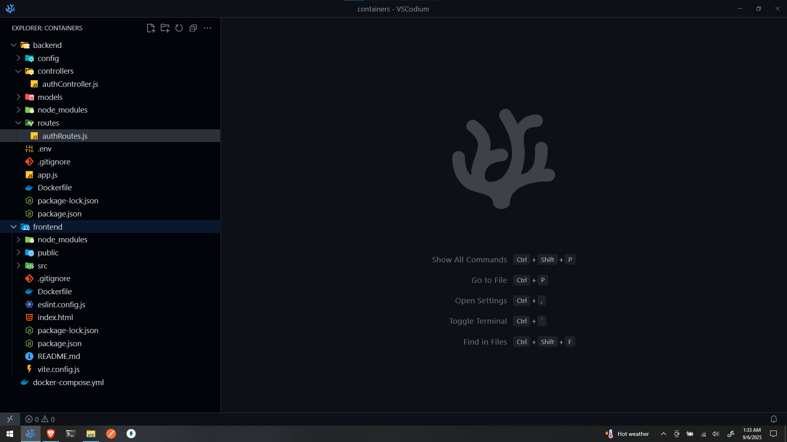
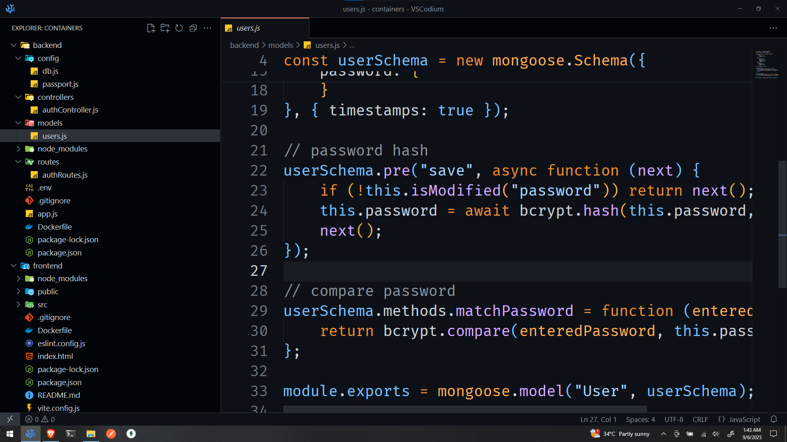

## Description
This repository contains my personal **VS Codium** configuration (`settings.json`).  
I prefer **VS Codium** over VS Code because it’s free from Microsoft’s telemetry and other unnecessary extras.  
Keeping this repo helps me maintain a clean, minimal setup and makes it easy to sync my editor across devices.  

## Preview
Here’s a glimpse of how my VS Codium looks:  

## Extensions I Use
- [Auto Open Preview Panel](https://marketplace.visualstudio.com/items?itemName=matt-rudge.auto-open-preview-panel) — Automatically opens Markdown preview  
- [Auto Rename Tag](https://marketplace.visualstudio.com/items?itemName=formulahendry.auto-rename-tag) — Rename paired HTML/XML tags  
- [ES7+ React/Redux/React-Native Snippets](https://marketplace.visualstudio.com/items?itemName=dsznajder.es7-react-js-snippets) — Handy snippets for React and Redux  
- [GitHub Theme](https://marketplace.visualstudio.com/items?itemName=GitHub.github-vscode-theme) — GitHub’s official theme  
- [Material Icon Theme](https://marketplace.visualstudio.com/items?itemName=PKief.material-icon-theme) — Beautiful and intuitive file icons  
